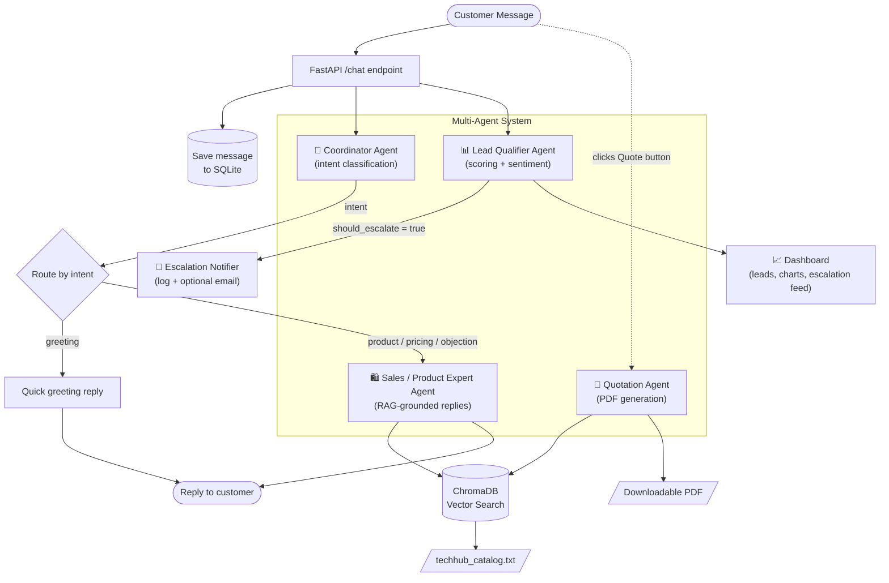

# SalesPilot AI

**The Multi-Agent Sales Team That Never Sleeps.**

Built for the FlowZint AI Hackathon 2026 — Sales Bot category.

🔗 **Live Demo:** https://sales-pilot-ai-sable.vercel.app/
🔗 **Backend API Docs:** https://salespilot-ai-nhaw.onrender.com/docs
🎥 **Demo Video:** 

> The backend runs on Render's free tier, which sleeps after 15 minutes of
> inactivity. The first message after a period of inactivity may take
> 30-60 seconds to respond while it wakes up.

---

## Problem Statement

Businesses lose valuable customers because of:

- Slow response times outside business hours
- Manual, inconsistent lead qualification
- Poor or forgotten follow-ups
- Generic recommendations with no real product knowledge
- Traditional rule-based chatbots that can't handle real conversation

## Solution

SalesPilot AI is a multi-agent AI sales platform that behaves like an
experienced sales team, not a single chatbot. It qualifies leads, answers
product questions grounded in real business data, generates actual
downloadable quotations, and automatically escalates high-value
conversations to a human — with visible, logged proof that the escalation
fired.

The live demo is built around **TechHub Computers**, a fictional laptop and
mobile phone retailer — but the architecture is domain-agnostic. Every
agent, the RAG pipeline, and the routing logic are unaware of "laptops" or
"TechHub" specifically; only one file (`techhub_catalog.txt`) is
business-specific. Swap that file, and the same system sells a different
business.

---

## Architecture



### Design Highlights

- **Strategy pattern for agents** — each specialist implements the same
  `handle()` interface; the Coordinator picks which one runs without
  needing to know how any of them work internally.
- **RAG grounding, not memorized answers** — the Sales Agent retrieves the
  actual catalog chunk via ChromaDB and answers only from what's retrieved,
  eliminating hallucinated prices or specs.
- **Confidence-gated escalation** — leads are escalated to a human only
  when *both* lead status is "Hot" *and* confidence crosses a threshold,
  reducing false alarms versus a simple keyword trigger.
- **Deterministic financial math** — discount and GST calculations run in
  plain Python, never the LLM, since generative models are unreliable at
  precise arithmetic and this involves real money.
- **Honesty-by-design guardrails** — the Sales Agent is explicitly
  instructed never to claim actions it can't perform (confirming an order,
  generating a document from chat text alone) — it directs customers to the
  real, working self-service features instead.
- **Model right-sizing** — classification tasks (Coordinator, Lead
  Qualifier) run on a smaller, faster model; the customer-facing Sales
  Agent uses a larger model for reply quality — also spreading load across
  separate rate-limit quotas.

---

## Tech Stack (100% free tier)

| Layer | Technology |
|---|---|
| Frontend | React, Vite, Recharts, Lucide Icons |
| Backend | FastAPI (Python) |
| AI / LLM | Groq API — Llama 3.1 8B Instant + Llama 4 Scout |
| Vector DB / RAG | ChromaDB (ONNX-based embeddings) |
| Database | SQLite |
| PDF Generation | ReportLab |
| Deployment | Render (backend) + Vercel (frontend) |

---

## Features

- 🤖 **Multi-agent AI** with visible, color-coded agent handoff in the chat UI
- 📚 **RAG-grounded responses** — zero hallucinated prices or specs
- 🎯 **Real-time lead scoring** — Hot / Warm / Cold with confidence %
- 😊 **Sentiment & urgency detection** on every conversation
- 🔔 **Escalation Feed** — real, logged proof of every hot-lead alert fired
- 🧾 **Instant PDF quotation generation** with accurate discount + tax math
- 📈 **Business dashboard** — lead distribution chart, live analytics
- 🕘 **Full conversation history** — click any lead to view the full transcript
- 🌐 **Fully deployed** — live public URLs, not just localhost

---

## Project Structure

```
salespilot-ai/
├── backend/
│   ├── agents/
│   │   ├── coordinator.py       # Intent routing
│   │   ├── sales_agent.py       # RAG-grounded product/sales replies
│   │   ├── lead_qualifier.py    # Lead scoring + sentiment
│   │   └── quotation_agent.py   # PDF quotation generation
│   ├── rag/vector_store.py      # ChromaDB wrapper
│   ├── knowledge_base/          # Business data (swap to change domains)
│   ├── database.py              # SQLite persistence
│   ├── notifier.py              # Escalation alerts
│   └── main.py                  # FastAPI app, all endpoints
└── frontend/
    └── src/
        ├── components/          # ChatWindow, Dashboard, modals, etc.
        ├── agentConfig.js       # Agent labels/colors (single source of truth)
        ├── api.js               # All backend communication
        └── App.jsx
```

---

## Running Locally

**Backend**
```bash
cd backend
python -m venv venv
venv\Scripts\activate
pip install -r requirements.txt
# Create .env with: GROQ_API_KEY=your_key_here
uvicorn main:app --reload --port 8000
```

**Frontend**
```bash
cd frontend
npm install
# Create .env with: VITE_API_URL=http://127.0.0.1:8000
npm run dev
```

---

## Future Enhancements

- WhatsApp Business API integration
- Telegram bot integration
- Full CRM integration
- PostgreSQL for production-grade persistence
- Payment gateway integration
- Automated email follow-ups
- Enterprise multi-tenant deployment — one platform, multiple businesses,
  each with their own catalog and branding

---

SalesPilot AI demonstrates that a genuinely production-minded AI sales
system can be built entirely on free-tier infrastructure — grounded,
honest, and ready to scale.